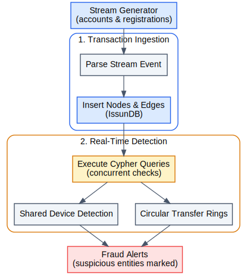

## Fraud Detection System

This example detects suspicious patterns and fraudulent behaviors in a real-time transaction stream.

### How It Works

1. Generates a continuous stream of financial transactions, accounts, and registration events.
2. Ingests the stream into IssunDB; map accounts, transactions, and devices as nodes and edges.
3. Executes Cypher queries concurrently over the database to identify circular transfers, shared devices, and stolen credentials.

More detailed workflow is shown below:

  <picture>
    
  </picture>

