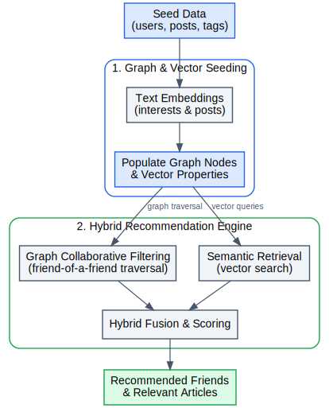

## Social Recommendation System

This example builds a social network graph and recommends content and friends to users.

### How It Works

1. Creates a graph of users, interests, followed tags, and published posts in IssunDB.
2. Computes text embeddings for posts and interests so we can run vector-based similarity checks on them.
3. Combines graph traversal (friend-of-a-friend collaborative filtering) and vector search (semantic similarity) to recommend relevant articles and
   new connections.

More detailed workflow is shown below:

  <picture>
    
  </picture>

