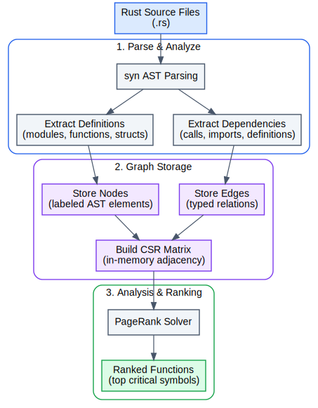

## Codebase Explorer

This example indexes Rust source code, builds a syntax dependency graph, and ranks functions by structural importance.

### How It Works

1. Parses Rust source files into abstract syntax trees (using the `syn` library).
2. Stores files, functions, structs, enums, and traits as nodes, with `CONTAINS`, `CALLS`, `METHOD_OF`, and `IMPLEMENTS` edges between them.
3. Answers structural questions over the graph, including callers and callees through Cypher, dead-code candidates, transitive impact through native
   adjacency traversal, the shortest call path between two functions, weakly connected components, and cycle detection.
4. Ranks functions by structural importance with PageRank over the code graph.

More detailed workflow is shown below:

  <picture>
    
  </picture>

