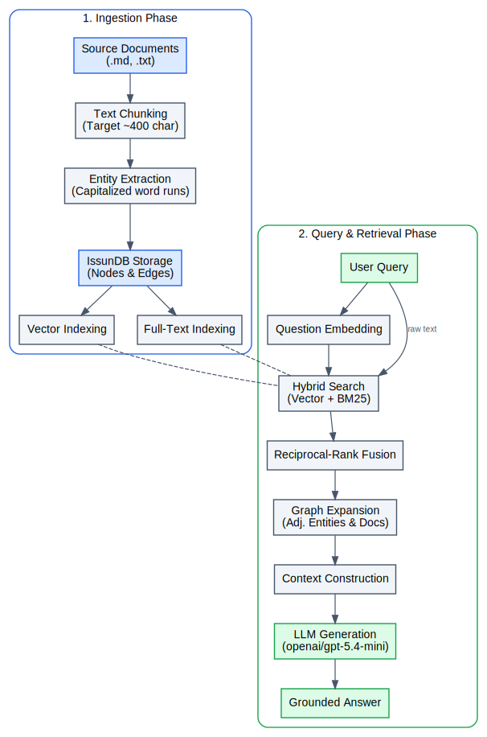

## GraphRAG Pipeline

This example implements a knowledge graph extraction and question-answering pipeline using IssunDB.

### How It Works

1. Reads text documents, splits them into text chunks, extracts entities, and records entity co-occurrences.
2. Indexes chunks using a vector index (for semantic retrieval) and an BM25 text index (for keyword retrieval).
3. Performs a hybrid search on both indexes and resolves the reciprocal-rank fusion of the results.
4. Traverses the graph structure to extract adjacent entities and document contexts.
5. Combines the retrieved context and queries an LLM to generate the final answer.

More detailed workflow is shown below:

  <picture>
    
  </picture>

